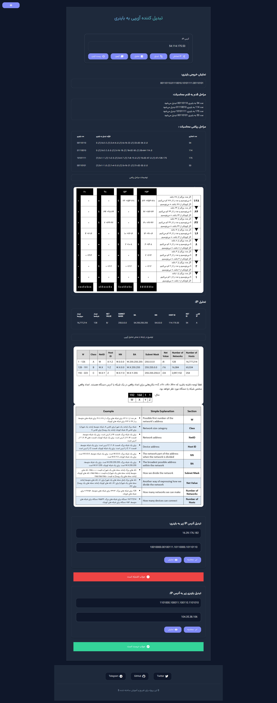

# 🧰 تبدیل‌گر IP به باینری | IP to Binary Converter

---

## 💡 معرفی

**تبدیل‌گر IP به باینری** یک برنامه تحت وب است که به کاربران امکان می‌دهد آدرس‌های IPv4 را به نمایش باینری آن‌ها تبدیل کنند. این برنامه یک رابط کاربری کاربرپسند و ویژگی‌های تحلیلی متنوعی مرتبط با آدرس‌های IP ارائه می‌دهد.

## 🚀 نسخه نمایشی آنلاین

برای استفاده از نسخه نمایشی **تبدیل‌گر IP به باینری**، [اینجا](https://ip-converter.netlify.app/) کلیک کنید.

این وب‌سایت به شما امکان می‌دهد یک آدرس IP را وارد کنید، آن را به فرمت باینری تبدیل کنید و ویژگی‌های تحلیلی را بررسی کنید.

لطفاً توجه داشته باشید که وب‌سایت نسخه نمایشی ممکن است تفاوت‌های جزئی یا ویژگی‌های اضافی مطرح شده داشته باشد.

## ✨ ویژگی‌ها

*   **تبدیل IP به باینری:** یک آدرس IPv4 را وارد کنید، و برنامه آن را به فرمت باینری تبدیل خواهد کرد. نمایش باینری در بخش خروجی نشان داده می‌شود.
*   **محاسبه گام به گام:** برنامه یک محاسبه گام به گام از فرآیند تبدیل باینری ارائه می‌دهد.
*   **تحلیل IP:** تجزیه و تحلیل دقیق آدرس IP وارد شده، از جمله کلاس IP، شناسه شبکه، شناسه میزبان، آدرس شبکه، آدرس پخش همگانی، ماسک زیرشبکه، ارزش شبکه، تعداد شبکه‌ها و تعداد میزبان‌ها را انجام می‌دهد.
*   **تولید IP تصادفی:** آدرس‌های IP تصادفی برای تبدیل تولید کنید.
*   **آزمون:** دانش خود را در مورد تبدیل IP به باینری از طریق یک ویژگی آزمون تعاملی آزمایش کنید.
*   🌙 **حالت شب (Dark Mode):** تجربه کاربری راحت‌تر در محیط‌های کم نور با دارک مود.
*   🎨 **رابط کاربری مدرن و جذاب:** طراحی زیبا و واکنش‌گرا با استفاده از CSS Variables و Tailwind CSS.
*   ✅ **بهبود بخش آزمون:** طراحی جذاب‌تر و بازخورد بصری برای نتایج آزمون.
*   📤 **قابلیت خروجی گرفتن (Export):** خروجی گرفتن از نتایج در فرمت‌های PDF, JSON, TXT, CSV. (به صورت موقت غیر فعال است)
*   ⌨️ **میانبرهای صفحه‌کلید (Keyboard Shortcuts):** استفاده سریع‌تر با میانبرهای صفحه‌کلید برای عملکردهای اصلی.
*   🌐 **آماده‌سازی برای IPv6:** ساختار کد آماده برای پشتیبانی از IPv6 در آینده.

## 🚀 نحوه استفاده

1.  فایل `IP to Binary Converter.html` را در یک مرورگر وب باز کنید.
2.  آدرس IP مورد نظر برای تبدیل را در فیلد ورودی وارد کنید.
3.  برای تبدیل آدرس IP به فرمت باینری، روی دکمه "تبدیل" کلیک کنید. نمایش باینری در بخش خروجی نشان داده خواهد شد.
4.  برای مشاهده تجزیه و تحلیل دقیق آدرس IP، روی دکمه "تحلیل" کلیک کنید.
5.  برای تولید یک آدرس IP تصادفی، روی دکمه "IP تصادفی" کلیک کنید.
6.  با کلیک روی دکمه "آزمون" آزمون را شروع کنید. پاسخ خود را وارد کنید و برای بررسی درستی آن، روی "محاسبه" کلیک کنید.
7.  برای تغییر حالت تم، روی دکمه ماه/خورشید در گوشه صفحه کلیک کنید.
8.  برای خروجی گرفتن از نتایج، از منوی خروجی فرمت مورد نظر خود را انتخاب کنید. (در حال حاضر غیر فعال است)

**مثال:**

فرض کنید می‌خواهید آدرس IP `192.168.0.1` را با استفاده از **تبدیل‌گر IP به باینری** به فرمت باینری تبدیل کنید.

1.  `192.168.0.1` را در فیلد ورودی وارد کنید.
2.  روی دکمه "تبدیل" کلیک کنید.
3.  بخش خروجی نمایش باینری آدرس IP را نمایش می‌دهد: `11000000.10101000.00000000.00000001`.

## ⚙️ وابستگی‌ها

**تبدیل‌گر IP به باینری** به وابستگی‌های زیر متکی است:

*   [Vazirmatn](https://github.com/rastikerdar/vazirmatn): فونت فارسی استفاده شده برای متن برنامه.
*   [Font Awesome](https://fontawesome.com/): برای آیکون‌ها.
*   [Bootstrap RTL](https://getbootstrap.rtlcss.com/): برای استایل‌دهی راست‌چین.
*   [Material Icons](https://fonts.google.com/icons): برای آیکون‌های بیشتر.
*   [Tailwind CSS](https://tailwindcss.com/): برای استایل‌دهی و واکنش‌گرایی.
*   [jsPDF](https://jspdf.com/): برای قابلیت خروجی PDF.

## ✅ سازگاری

**تبدیل‌گر IP به باینری** باید در اکثر مرورگرهای وب مدرن با قابلیت جاوا اسکریپت فعال کار کند.

## 🗺️ نقشه راه

*   ✅ **رسیدگی به خطای پیشرفته:** بهبود رسیدگی به خطا برای ورودی نامعتبر و ارائه پیام‌های خطای آموزنده به کاربران.
*   ☑️ **پشتیبانی از IPv6:** گسترش مبدل برای پشتیبانی از آدرس‌های IPv6 و نمایش باینری آن‌ها.
*   ✅ **رابط کاربری کاربرپسند:** بهبود رابط کاربری برای ارائه یک تجربه بصری جذاب‌تر و شهودی‌تر.
*   ☐ **تحلیل‌های اضافی:** افزودن ویژگی‌های تحلیلی بیشتر، مانند شناسایی کلاس شبکه بر اساس ماسک زیرشبکه یا تشخیص آدرس‌های IP خصوصی.
*   ☐ **تاریخچه تبدیل:** پیاده‌سازی یک ویژگی تاریخچه تبدیل که به کاربران امکان می‌دهد آدرس‌های IP تبدیل شده قبلی را مشاهده و بازیابی کنند.
*   ☐ **بومی‌سازی:** افزودن پشتیبانی از چندین زبان، که به کاربران امکان می‌دهد از برنامه به زبان دلخواه خود استفاده کنند.
*   ✅ **بهینه‌سازی عملکرد:** بهینه‌سازی کد و الگوریتم‌ها برای بهبود عملکرد و کارایی مبدل.

این‌ها فقط چند ایده برای بهبود بیشتر **تبدیل‌گر IP به باینری** هستند. اگر ایده‌ای دارید یا مایل به مشارکت در پروژه هستید، می‌توانید یک Issue باز کنید یا درخواست Pull Request ارسال کنید. یا حتی در سوشال مدیا به من پیام دهید!

## مجوز

این پروژه تحت [مجوز MIT](LICENSE) منتشر شده است.

شما آزاد هستید که این پروژه را برای اهداف شخصی و تجاری استفاده کنید، تغییر دهید و توزیع کنید. با این حال، طبق شرایط مجوز MIT، هنگام استفاده از این نرم‌افزار یا آثار مشتق شده از آن، باید به منبع اصلی اعتبار دهید. لطفاً برای اطلاعات بیشتر فایل [LICENSE](LICENSE) را مطالعه کنید.

**الزام Attribution:**

هنگام استفاده از تبدیل‌گر IP به باینری یا آثار مشتق شده از آن، باید با درج اطلاعات زیر، Attribution مناسب را ارائه دهید:

*   **نام نرم‌افزار:** IP to Binary Converter
*   **نویسنده اصلی:** Ham3ds
*   **لینک به مخزن اصلی:** [https://github.com/Ham3d-s/ip-converter](https://github.com/Ham3d-s/ip-converter)

توسعه داده شده توسط [Ham3ds](https://github.com/Ham3d-s).

---
